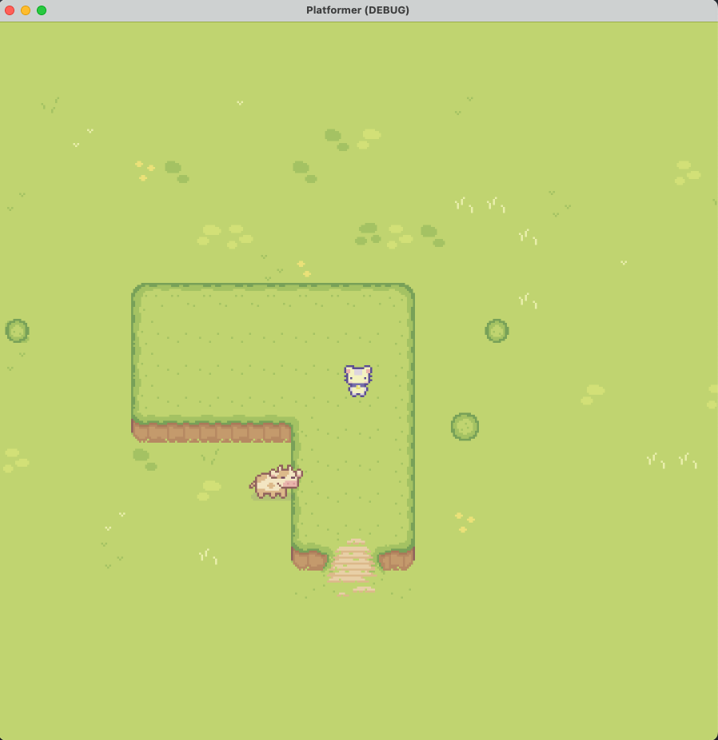

# First steps in Godot

## Tutorial
https://www.youtube.com/watch?v=Luf2Kr5s3BM

### Lesson 1
Creating scafold:
    - Game window
    - Player
    - Player movemnt

### Lesson 2
Creating World:
    - Background
    - World collision
    - Cows

